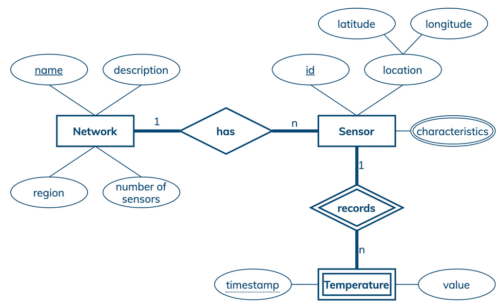
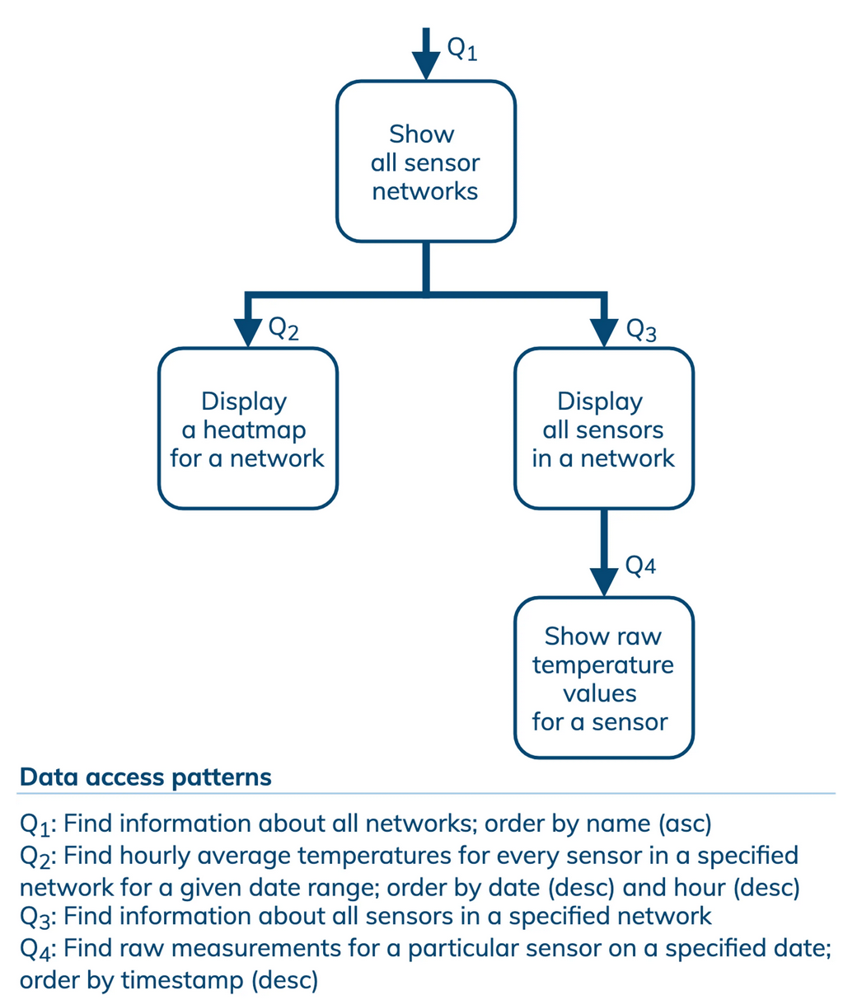
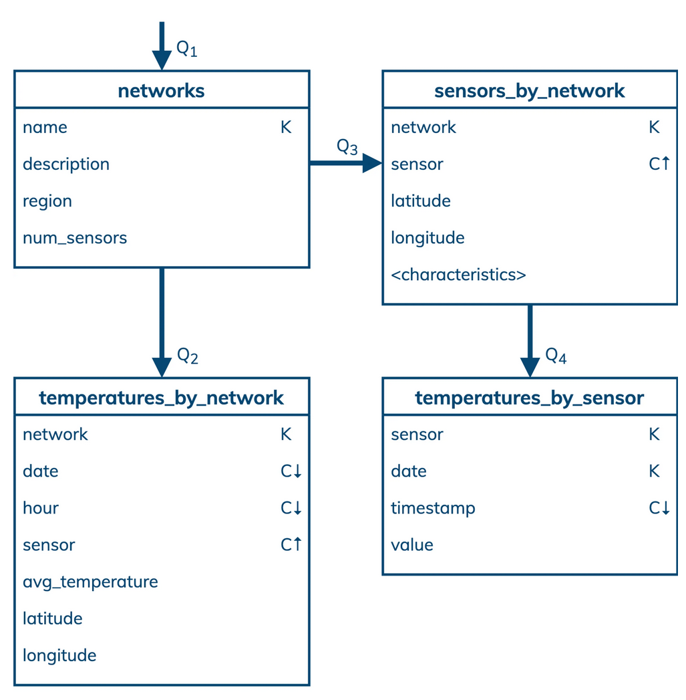
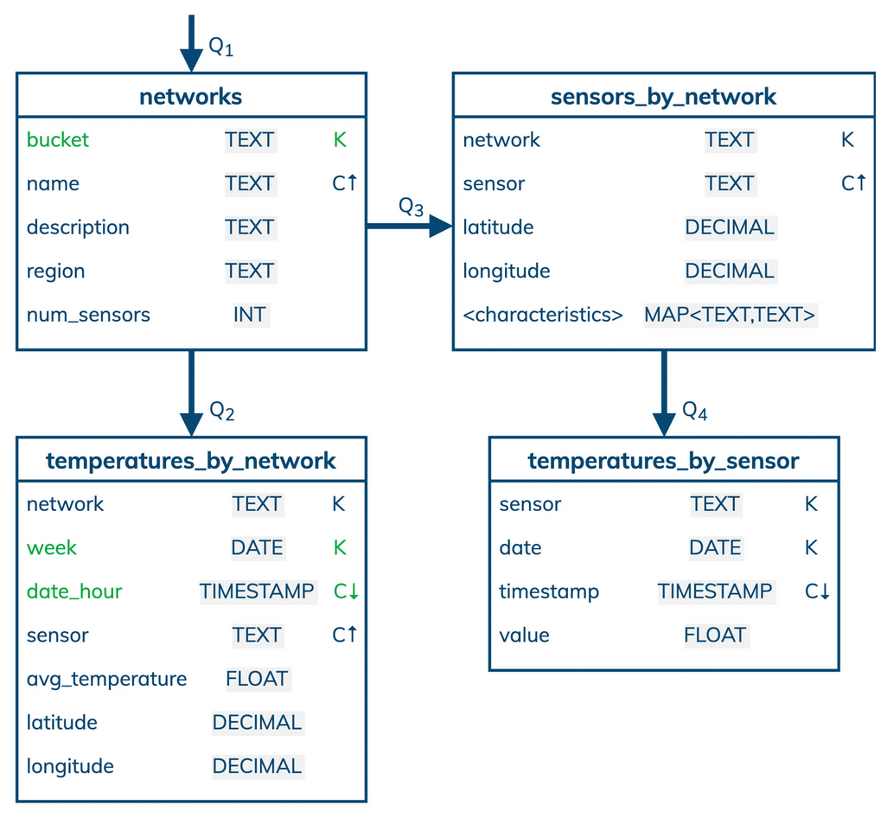
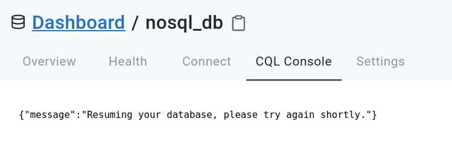
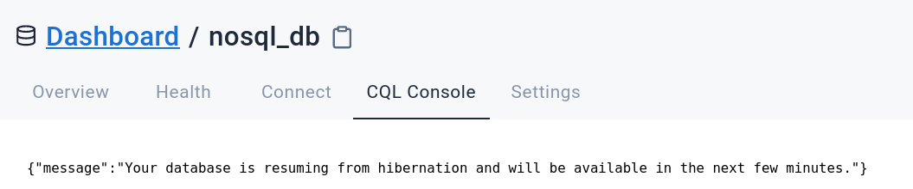
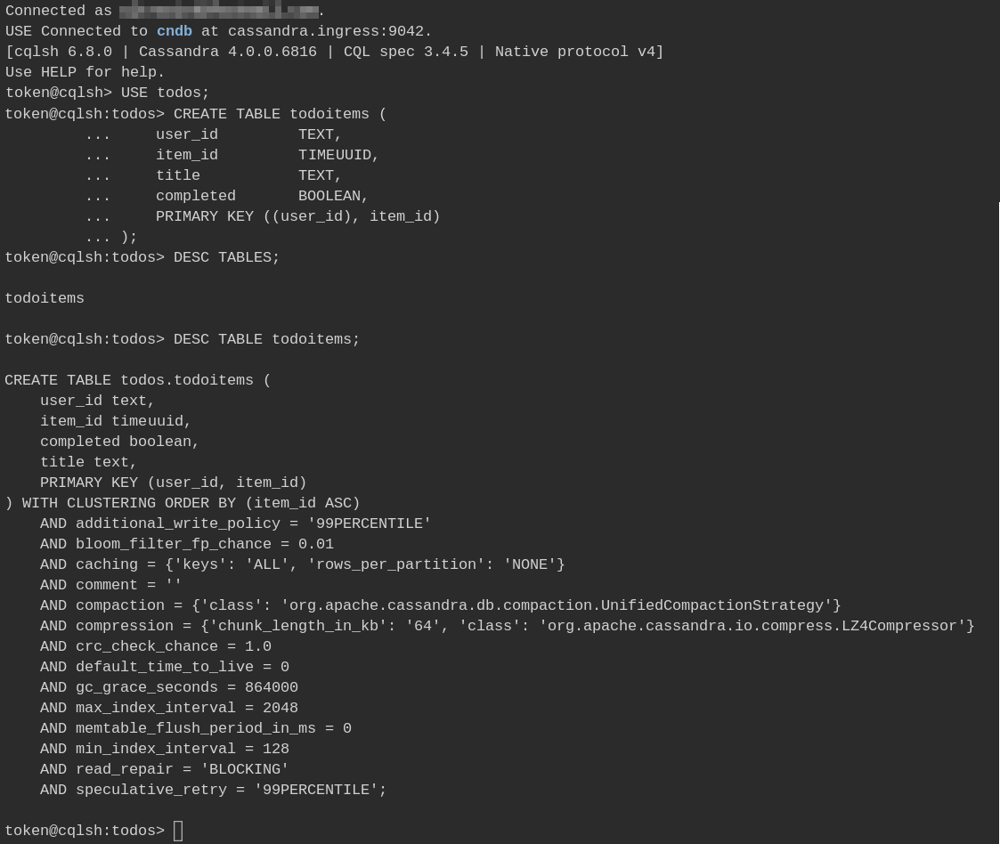
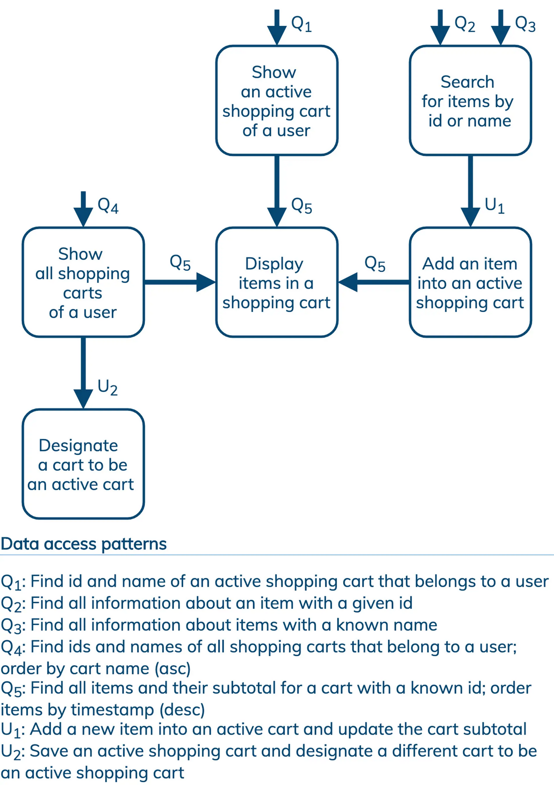
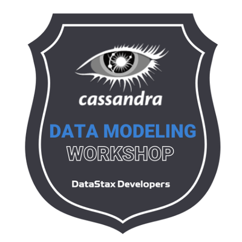

## 🎓🔥 Build a Data Model with Cassandra 🔥🎓


Welcome to **Building Efficient Data Model with Cassandra**! In this two-hour workshop, the Developer Advocate team of DataStax presents the process and the main tenets
of Data Modeling as is done when working with Apache Cassandra, the powerful distributed
NoSQL database that has been covered in [the first week of this bootcamp](../week1-intro-to-cassandra).

For the [hands-on part of this workshop](#4-a-simple-todo-app), we will use Astra DB, a Database-as-a-Service
built on Cassandra and delivered by DataStax, to create the actual data model which
will then be used in the next weeks as the data store for a Web application.

It doesn't matter if you join our workshop live or you prefer to do at your own pace, we have you covered. But please if you did not attend [the previous week](../week1-intro-to-cassandra)
we suggest you start from that one!
In this repository, you'll find everything you need for this workshop:

- [Materials used during presentation](https://github.com/datastaxdevs/bootcamp-fullstack-apps-with-cassandra/raw/main/week2-data-modelling/slides/Presentation.pdf)
- [Hands-on exercises](https://github.com/datastaxdevs/bootcamp-fullstack-apps-with-cassandra/tree/main/week2-data-modelling#table-of-contents)
- [Workshop video](https://youtu.be/2g1DPHMmI8s)
- [Discord chat](https://dtsx.io/discord)
- [Questions and Answers](https://community.datastax.com/)

## Homework

To complete the workshop and get a verified badge, follow these simple steps:

1. Watch the workshop live or recorded.
2. Try to come up with your own data model for the assignment [below](#5-data-model-assignment) and get ready to submit it in the form of a screenshot (of either Chebotko diagrams or CQL `CREATE TABLE` statements).
3. Complete the DS201 (Cassandra Fundamentals) course sections 9 - 16 [HERE](https://academy.datastax.com). Look at the setup instructions from [Week 1](../week1-intro-to-cassandra) if needed.

> _If you are feeling adventurous complete the DS201 exercises using the following Docker image. DO NOT attempt to use the virtual machines in the course._
>
> ```
> docker run -d -t --name class-201 drchung5/ds201
> docker exec -u root -it class-201 bash
> ```
4. [Submit the Homework through this form](https://dtsx.io/homework-cassandra-data-modelling) and attach the screenshot above.
5. Give us a few days to review your submission, and relax: your well-earned badge will soon land in your mailbox!

## Table of Contents

| Title  | Description
|---|---|
| **Slide deck** | [Slide deck for the workshop](https://github.com/datastaxdevs/bootcamp-fullstack-apps-with-cassandra/raw/main/week2-data-modelling/slides/Presentation.pdf) |
| **1. Create your Astra DB instance** | [Create your Astra DB instance](#1-create-your-astra-db-instance) |
| **2. A first data model** | [A first data model](#2-a-first-data-model) |
| **3. Another example** | [Another example](#3-another-example) |
| **4. A simple TODO App** | [A simple TODO App](#4-a-simple-todo-app) |
| **5. Data model assignment** | [Data model assignment](#5-data-model-assignment) |


## 1. Create your Astra DB instance

**NOTE**: if you come from Week 1, you will have your Astra DB account already: in that case, all you have to do
is creating a new keyspace, called `todos`, then skip to [Section 2](#2-a-first-data-model). If you stick to this keyspace name, it will be ready to be used when building the application in the next weeks!

<details><summary>Show me how to add a keyspace!</summary>
  
</details>

If you are new to Astra DB, please read on.

_**`ASTRA DB`** is the simplest way to run Cassandra with zero operations at all - just push the button and get your cluster. No credit card required, $25.00 USD credit every month, roughly 5M writes, 30M reads, 40GB storage monthly - sufficient to run small production workloads._

✅ Register (if needed) and Sign In to Astra DB [https://astra.datastax.com](https://astra.dev/1-12): You can use your `Github`, `Google` accounts or register with an `email`.

_Make sure to chose a password with minimum 8 characters, containing upper and lowercase letters, at least one number and special character_

✅ Choose "Start Free Now"

Choose the "Start Free Now" plan, then "Get Started" to work in the free tier.

You will have plenty of free initial credit (renewed each month!), roughly corresponding
to 80 GB of storage and 20M read/write operations.

> If this is not enough for you, congratulations! You are most likely running a mid- to large-sized business! In that case you should switch to a paid plan.

(You can follow this [guide](https://docs.datastax.com/en/astra/docs/creating-your-astra-database.html) to set up your free-tier database with the $25 monthly credit.)

- **For the database name** - use `workshops`. While Astra DB allows you to fill in these fields with values of your own choosing, please follow our recommendations to ensure the application runs properly.

- **For the keyspace name** - use `todos`. Please stick to this name, it will make the following steps much easier (you have to customize here and there otherwise). In short:

| Parameter | Value 
|---|---|
| Database name | workshops  |
| Keyspace name | todos |

_Note_: if you already have a `workshops` database, for instance from a previous workshop with us, you can simply create the keyspace with the `Add Keyspace` button in your Astra DB dashboard: the new keyspace will be available in few seconds.

- **For provider and region**: Choose any provider (either GCP, AWS or Azure). Region is where your database will reside physically (choose one close to you or your users).

- **Create the database**. Review all the fields to make sure they are as shown, and click the `Create Database` button.

You will see your new database as `Pending` in the Dashboard;
the status will change to `Active` when the database is ready. This will only take 2-3 minutes
(you will also receive an email when it is ready).

## 2. A first data model

This example, discussed in the presentation, is a table from a [video-sharing application](https://killrvideo.github.io/) built as a reference application
to illustrate, among other topics, Cassandra data model.

This table supports a query corresponding to _"get all users who live in a given city"_ and the corresponding CQL CREATE TABLE statement is
as follows:


Please refer to the [presentation material](https://github.com/datastaxdevs/bootcamp-fullstack-apps-with-cassandra/raw/main/week2-data-modelling/slides/Presentation.pdf) and the [workshop video](https://youtu.be/2g1DPHMmI8s)
for details; here we simply provide a few key comments to get you started:

- all columns in the table are declared along with their data type;
- the primary key is comprised of four of these columns which, taken together, have a unique value for each distinct row in the table;
- of the primary key fields, only `city` forms the partition key: hence, all users from the same city will be together in the same partition, ready to be retrieved at once with a single query;
- `last_name`, `first_name` and `email`, the _clustering columns_, define the sort order within partitions - and we chose this one because it fit well with our application's needs; _(and they are listed from most- to least-significant)_;
- we had to make sure `email` is in the primary key to make sure "the many John Smiths in New York each get a different row in our table" (uniqueness!);
- _(we do not assume there was a `USE killrvideo;` statement before this one, so we spell out the keyspace name explicitly when naming the table)._

## 3. Another example

This example, illustrated by the presenters, is about a sensor network for an IoT application. Please refer to the [presentation
material](https://github.com/datastaxdevs/bootcamp-fullstack-apps-with-cassandra/raw/main/week2-data-modelling/slides/Presentation.pdf) and the [workshop video](https://youtu.be/2g1DPHMmI8s) for details: here we only give
diagrams of the process for your convenience (click to expand/show each).

<details>
    <summary>1. Entity-relationship diagram</summary>
    
</details>

<details>
    <summary>2. Application workflow</summary>
    
</details>

<details>
    <summary>3. Logical data model</summary>
    
</details>

<details>
    <summary>4. Physical data model</summary>
    
</details>

## 4. A simple TODO App

**This is the hands-on part: get your Astra DB CQL Console ready!**

Now you can go ahead and actually create a table in Astra DB. You will be using the `todos` keyspace
created earlier. This will be the table used by the TODO App that will be built in the next weeks
of this bootcamp, so pay attention!

> The TODO App is a rather simple application: its whole data model will fit into a single table,
> and designing it properly will be a simple and quick task, as you will momentarily see.

Our TODO App will allow the user to manage "todo items" (such as "Walk the dog") and mark them as done. That's it.
Let's see the data modeling process at play in this miniature example.


**✅ Step 4a. Conceptual Data Model and App Workflow**

Let's start with the entity-relationships (well, ... more like "entities only" in this example).
We want a single table to store todo-items, theoretically pertaining to different users.
So, every todo-item will sure need a "user id" attribute. It will also need its own
unique identifier, to distinguish it from other todo items (and for us to be able to retrieve
and modify it individually).

Further, every todo-item will have two other attributes: a title ("Walk the dog")
and a boolean flag to mark whether the item has been done already or not. And as
far as the entities and their attributes go, that's about it. We then have:

    todoitem => (user_id, item_id, title, completed)

Now let's think of the application workflow. Again, this is rather simple: we let
the user view their own todo items and create/delete/modify one of them at a time.

We then identify only one data access pattern that our table will need to support:

    WF1: user wants to see all of their todoitems

which immediately can be expressed as a query:

    Q1: get all todoitems pertaining to a given user (identified by user_id)

In other words,

```sql
SELECT [something] FROM todoitems WHERE user_id = 'john';
```

The other CRUD operations supported (create/delete/edit a todo-item) act on a single
row and pose no challenge to the choice of the data model.
_In particular, altering
an existing item can involve changes to at most `title` and `completed`: no other
fields will ever need to be modified on an existing row._

**✅ Step 4b. Logical Data Model**

In order to arrive at a Chebotko diagram for the table, we proceed through a series
of steps.

First, the query must return `title` and `completed` for the app to display
items correctly.

Look at the WHERE clause in Q1: we sure need `user_id` in this table. Moreover, that
has to be the partitioning for the table, since we want to get all todoitems
for a user _at once_.

Now, we need to guarantee uniqueness of the rows: let's not forget column `item_id` for that,
which then must be part of the primary key (but not in the partition key).
_Observe that this choice of primary key does not contain fields that are subject
to being edited in the app - that would be an incompatible situation._

We anticipate that we will be using a TIMEUUID for the `item_id` column, which allows
for a meaningful time-ordering: so we decide that we will want to get earlier todo items
first when querying (clustering order `ASC`).

Our logical Chebotko diagram looks then like this:

| **todoitems** | |
|---|---|
| `user_id` | **K** |
| `item_id` | **C↑** |
| `title` | |
| `completed` | |

**✅ Step 4c. Physical Data Model**

All is left now is to pin down the actual data types for the table
and, if necessary, apply other optimizations.

In this case there is not much
to optimize (no relations, no collection types and so on), so we just have
to decide the data types. We like to keep `user_id` human-readable (it will
probably be hardcoded in our simplified TODO App anyway), so a simple `TEXT`
will do; and as mentioned already we choose `TIMEUUID` for the item ID in order
to exploit its time-ordering property.

> Another, perhaps more valid choice for `user_id` would be the `UUID` type. Here we
> stick to `TEXT` for the sake of human-readability - in this sample TODO App we
> will probably just hardcode a value such as "john" here.
> In a real-life app one could want to employ
> the user email for this column... but what if the user wants to change their email?

As for `title` and `completed`, there is
a natural choice and we stick to it.

We then have a final physical diagram, and with that the process is complete:

| **todoitems** | | |
|---|---|---|
| `user_id`   | TEXT | **K** |
| `item_id`   | TIMEUUID | **C↑** |
| `title`     | TEXT | |
| `completed` | BOOLEAN | |

**✅ Step 4d. Table creation in Astra DB**

Ok, it's time to go to the CQL Console of your `workshops` database in Astra DB
and actually issue a `CREATE TABLE` statement.

First you need to open the CQL Console: in the Summary screen for your database, select **_CQL Console_** from the top menu in the main window. This will take you to the CQL Console and automatically log you in.

<details>
    <summary>Show me how to get to the CQL Console</summary>
    
</details>

**NOTE**: If you created the database on Week 1, but did not use it recently,
it may have been hibernated - your should see a message telling you so when trying
to open the CQL Console. Don't worry and wait a couple of minutes while your DB comes
back to operational, then click the CQL Console tab again.

<details>
    <summary>Show me a DB being resumed from hibernation</summary>





</details>

Once you are in the CQL Console, first `USE` the correct keyspace:

```sql
USE todos;
```

You can now enter the following table-creation statement, which exactly corresponds
to the physical Chebotko diagram mentioned above:

```sql
CREATE TABLE todoitems (
    user_id         TEXT,
    item_id         TIMEUUID,
    title           TEXT,
    completed       BOOLEAN,
    PRIMARY KEY ((user_id), item_id)
) WITH CLUSTERING ORDER BY (item_id ASC);
```

To make sure that the creation succeeded, check the output of:

```sql
DESC TABLES;

DESC TABLE todoitems;
```

<details>
    <summary>Show me! </summary>
    
</details>

Congratulations, your table is ready to be used! All is left is ... building the app!

Here are some sample CRUD operations to "test" your shiny new table. These are substantially equivalent to the access
pattern that will be employed by the app:

```sql

// insert sample todo-items
INSERT INTO todoitems (user_id, item_id, completed, title) VALUES ( 'john', 11111111-5cff-11ec-be16-1fedb0dfd057, true, 'Walk the dog');
INSERT INTO todoitems (user_id, item_id, completed, title) VALUES ( 'john', 22222222-5cff-11ec-be16-1fedb0dfd057, false, 'Have lunch tomorrow');
INSERT INTO todoitems (user_id, item_id, completed, title) VALUES ( 'mary', 33333333-5cff-11ec-be16-1fedb0dfd057, true, 'Attend the workshop');

// query all items for a given user
SELECT * FROM todoitems WHERE user_id = 'john';

// mark an item as "done" (full primary key must be specified)
UPDATE todoitems SET completed = true WHERE user_id = 'john' AND item_id = 22222222-5cff-11ec-be16-1fedb0dfd057;
SELECT toTimestamp(item_id), completed, title FROM todoitems WHERE user_id = 'john';

// remove an item (full primary key must be specified)
DELETE FROM todoitems WHERE user_id='john' AND item_id=11111111-5cff-11ec-be16-1fedb0dfd057;
SELECT toTimestamp(item_id), completed, title FROM todoitems WHERE user_id = 'john';

// WARNING: this removes *all* rows (we make the table clean and ready for actual usage)
TRUNCATE TABLE todoitems;
```

## 5. Data model assignment

_This is the data-modeling exercise assignment for next week. Please follow
the methodology to design the tables for the "Shopping Cart",
as described in the specifications below, and submit
a screenshot, of either the CQL CREATE TABLE statements or the corresponding
Chebotko diagrams, along with the rest of the assignment [here](#homework),
to be awarded a nice verified badge!_

**"Shopping Cart" data model specifications**

For our hypothetical e-commerce app, we have users, items and shopping carts:

- Users have a unique id, plus other attributes (name, email, ...).
- Items have an id, a name, a description and a price.
- Shopping carts have an id as well and can be either "saved" or "active"; they also have a name, a subtotal and other attributes.

Users can have several shopping carts, while shopping carts belong to exactly one user. A user can have at most _one_ active cart at a time (the other being "saved").

Shopping carts, in turn, can have several items in them - and an item can appear in as many carts as desired, and comes with a timestamp of insertion and a quantity (a non-negative integer).

The subtotal for a cart in principle could be computed at application level by summing over the price of the items (and taking the quantity into account);
however, here we suggest to create it as an attribute of the cart, with the intention of keeping it updated, at application level, whenever the cart contents change (you may find it convenient to employ a [static column](https://docs.datastax.com/en/cql-oss/3.3/cql/cql_using/refStaticCol.html) as an optimization).

The application workflow that your model will have to support is comprised of the following data access patterns:



**Now go ahead and start data modelling: Good luck!**



**... and see you at our next workshop!**

> Sincerely yours, The DataStax Developers
