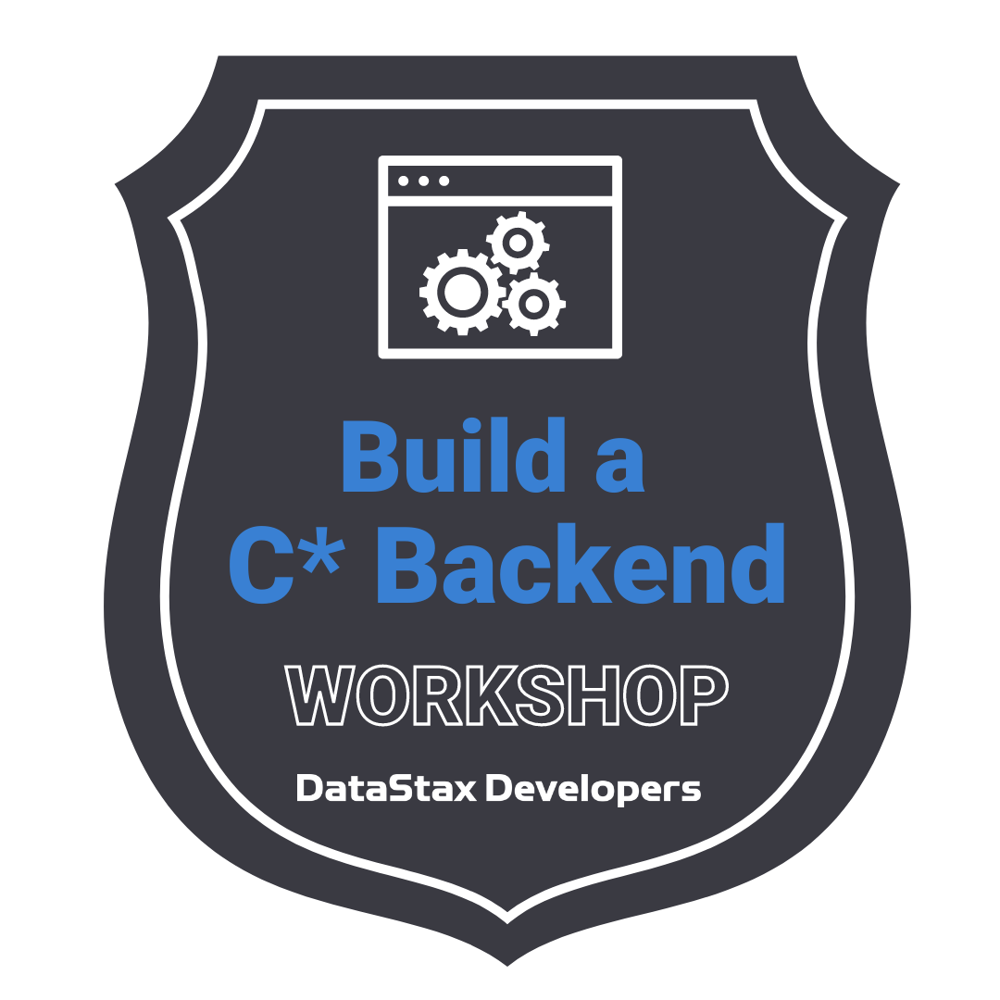
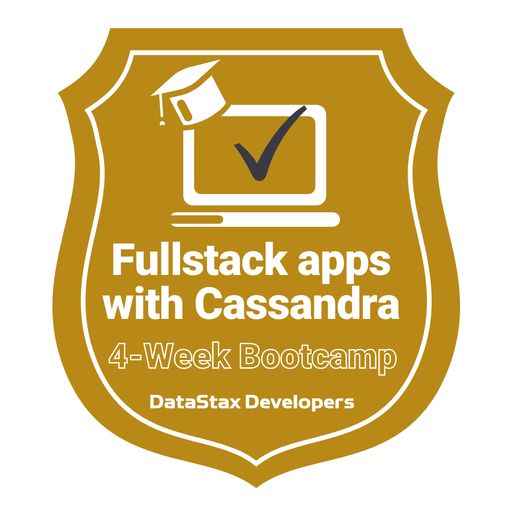

## 🎓🔥 Back End App Dev with Cassandra 🔥🎓


Welcome to the 'App Dev of back end with Cassandra' workshop! In this two-hour workshop, the Developer Advocate team of DataStax presents the process and the basic tenets of backend App Dev. If you did not attend the previous workshops, please look at the previous weeks of the bootcamp 
[Week 1 - Intro to Cassandra](../week1-intro-to-cassandra) and [Week 2 - Data Modelling](../week2-data-modelling).

For the hands-on part of this workshop, we will use Astra DB, a Database-as-a-Service
built on Cassandra and delivered by DataStax, that was created as the data store for the Web application.

It doesn't matter if you join our workshop live or you prefer to do at your own pace, we have you covered. But please if you did not attend [Week 1 - Intro to Cassandra](../week1-intro-to-cassandra) and/or [Week 2 - Data Modelling](../week2-data-modelling) we suggest you get caught up since the material in this workshop will build on top of the previous weeks' workshops!

In this repository, you'll find everything you need for this workshop:

- [Materials used during presentations](https://github.com/datastaxdevs/bootcamp-fullstack-apps-with-cassandra/blob/main/week3-app-development/slides/WEEK3%20-%20App%20Development%20with%20Cassandra.pdf)
- [Hands-on exercises](https://github.com/datastaxdevs/bootcamp-fullstack-apps-with-cassandra/tree/main/week3-app-development#table-of-contents)
- [Workshop video](https://youtu.be/iwDKqUesqvE)
- [Discord chat](https://dtsx.io/discord)
- [Questions and Answers](https://community.datastax.com/)

## Homework

To complete the workshop and get a verified badge, follow these simple steps:

1. Watch the workshop live or recorded.
2. TBD
3. [Submit the Homework through this form](https://dtsx.io/homework-bootcamp-2022-week3) and attach the screenshots above.
4. Give us a few days to review your submission and relax: your well-earned badge will soon land in your mailbox!

## 0. Table of Contents

| Title  | Description
|---|---|
| **Slide deck** | [Slide deck for the workshop](slides/WEEK3%20-%20App%20Development%20Awith%20Cassandra.pdf) |
| **1. Connect to your Astra DB instance** | [Connect to your Astra DB instance](#1-connect-to-your-astra-db-instance) |
| **2. Create Astra Token** | [Create Astra Token](#2-create-astra-token) |
| **3. Launch Gitpod** | [Launch Gitpod](#3-launch-gitpod) |
| **4. Know your Gitpod** | [Know your Gitpod](#4-know-your-gitpod) |
| **5. Setup your Application** | [Setup your Application] (#5-setup-your-application)
| **6-10. CRUD with Cassandra** | [CRUD with Cassandra](#6-crud-with-cassandra) |
| **11. Homework/Assignment and Badges** | [Homework/Assignment and Badges](#11-homework-assignment-badges) |


## 1. Connect to your Astra DB instance

**Once again, If you did not attend the previous workshops, please look at the previous weeks of the bootcamp 
[Week 1 - Intro to Cassandra](../week1-intro-to-cassandra) and [Week 2 - Data Modelling](../week2-data-modelling) please complete that first.**

Now that you've created a database and keyspace already and familiarized yourself with the Astra console, we will start preparing to connect to the database, programmatically.

There are several language drivers (includes Java, NodeJS, Python) to access a Cassandra database programmatically and each with different capabilites. The driver matrix is at [https://docs.datastax.com/en/driver-matrix/doc/driver_matrix/common/driverMatrix.html](https://docs.datastax.com/en/driver-matrix/doc/driver_matrix/common/driverMatrix.html).

In principle, they all work by setting up a connection to the database and manipulating the data via CQL statements or higher abstractions referred to as collections.

We will start by establishing connectivity (which is common across languages) and then branch off into the respective language paths.

To establish connectivity to the Astra database that we created, we need some credentials from the Astra console and we need to use a secure connect bundle alongside the driver. The next few steps will accomplish just that.

## 2. Create Astra Token

We need to create a **token** that we will use as our credentials.

✅ **Step 2a: Generate Token**

Following the [Manage Application Tokens docs](https://docs.datastax.com/en/astra/docs/manage-application-tokens.html) create a token with `Database Administrator` roles.

- Go the `Organization Settings`

- Go to `Token Management`

- Pick the role `Database Admnistrator` on the select box

- Click Generate token

**👁️ Walkthrough**


This is what the token page looks like. You can now download the values as a CSV. We will need those values but you can also keep this window open for use later.


Notice the clipboard icon at the end of each value.

- `Client Id:` We will use it as a _username_ to connect to Astra.

- `Client Secret:` We will use it as a _password_ to connect to Astra.

- `appToken:` It can be used as an api token Key to interact with APIs.

To know more about roles, tokens, etc. you can lok at [this video.](https://www.youtube.com/watch?v=TUTCLsBuUd4)

**Note: Make sure you don't close the window accidentally or otherwise - if you close this window before you copy the values, the application token is lost forever. They won't be available later for security reasons. You'll have to create a new application token**

We are now set with the database and credentials. Let's start coding with Quarkus!

[🏠 Back to Table of Contents](#0-table-of-contents)

## 3. Launch Gitpod

[Gitpod](https://www.gitpod.io/) is an IDE 100% online based on [VS Code](https://github.com/gitpod-io/vscode/blob/gp-code/LICENSE.txt?lang=en-US). To initialize your environment simply click on the button below _(CTRL + Click to open in new tab)_ You will be asked for you github account, as needed.

[](https://gitpod.io/#https://github.com/datastaxdevs/bootcamp-fullstack-apps-with-cassandra)

**👁️ Expected output**

_The screenshot may be slightly different based on your default skin and a few edits in the read me._


**That's it.** Gitpod provides all tools we will need today including for respective languages. 

**You may safely ignore the error output at the end of the terminal window.**

**👁️ Expected output**


Although GitPod terminal might seem to be available, the setup might still be ongoing. Wait for a few minutes before entering commands in the GitPod terminal window.

[🏠 Back to Table of Contents](#table-of-contents)

## 4. Know your Gitpod

Take a moment to read this entire section since it'll help you with the rest of the workshop as you'll be spending most of your time in Gitpod. If you're familiar with Gitpod, you can easily skip this entire section.

The extreme left side has the explorer view(1). The top left, middle to right is where you'll be editing files(2), etc. and the bottom left, middle to right is what we will refer to as the Gitpod terminal window(3) as shown below.

**👁️ Expected output**


You can always get back to the file explorer view whenever by clicking on the hamburger menu on the top left followed by `View` and `Explorer` as shown below.


You may encounter the following at different steps and although this may not be applicable right away, the steps are included **in advance** and summarized here so that you can keep an eye out for it. Different paths and different environments might be slightly different although Gipod levels the playing field a bit.

You can allow cutting and pasting into the window by clicking on `Allow` as shown below.


Or allow ports to be opened by just exiting windows that are informational messages about ports like below.


[🏠 Back to Table of Contents](#0-table-of-contents)

## 5. Setup your application

To run the application you need to provide the credentials and identifier to the application.

Issue the following command from the Gitpod terminal window.

```
gp open src/main/resources/application.properties
```


✅ **Step 5a: Enter 2 values from the token**


Enter the values of `Client Id` and `Client Secret` from values noted earlier for `username` and `password` respectively. The two lines with a TBD in comments is shown below.


✅ **Step 5b: Download the secure connect bundle**


This next step is probably the most involved step in the entire workshop. The goal of this step is to get the customized connect bundle into Gitpod. One of the several ways of doing this is as follows.

Start with the [Astra DB dashboard](https://astra.datastax.com) and for the database workshops,

1. Click on `Connect` tab.
2. Click on Connect using a driver `Java`.
3. Click on `Download Bundle`.
4. Click on `Secure Connect Bundle` to be able to copy the link locally.

as shown below.

	

Locate the file locally in the finder/explorer window. Drag and drop the file into the Gitpod explorer window (on the left side, making sure that the cursor, indicating the drop is positioned in the Gitpod explorer window as shown below.


In the Gitpod terminal window, verify that you dropped the right file and at the top level directory

```bash
ls -l secure-connect-workshops.zip
```

The file size should be roughly 12K otherwise something may have gone wrong in the process.

**👁️ Expected output**

```
-rw-r--r-- 1 gitpod gitpod 12231 Oct 26 00:15 secure-connect-workshops.zip
```

TADA your application is now configured we can finally play with some code.

[🏠 Back to Table of Contents](#0-table-of-contents)


## 6. CRUD with Cassandra

Exercises will be different for each language. Pick the language you feel the most confortable with with and JUMP to the respective README.

| Sections | Material Description
| - |---|
| **** | [Exercises 6 to 10 with JAVA](./java/README.MD) |
| **** | [Exercises 6 to 10 with JAVASCRIPT](./javascript/README.MD) |
| **** | [Exercises 6 to 10 with PYTHON](./python/README.MD) |

[🏠Back to HOME workshop](https://github.com/datastaxdevs/bootcamp-fullstack-apps-with-cassandra)

## 11. Homework/Assignment and Badges

**Now go ahead and start app dev: Good luck!**



**... and see you at our next workshop!**

You might be eligible for a badge when you attend more workshops and complete the requirements.



> Sincerely yours, The DataStax Developers

THE END.