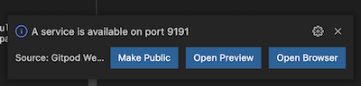
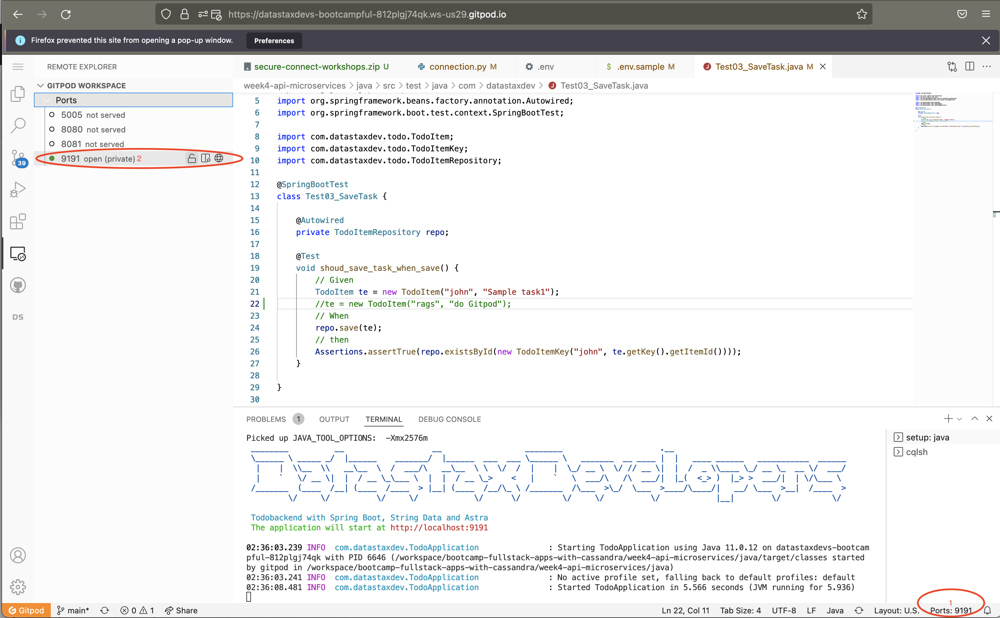
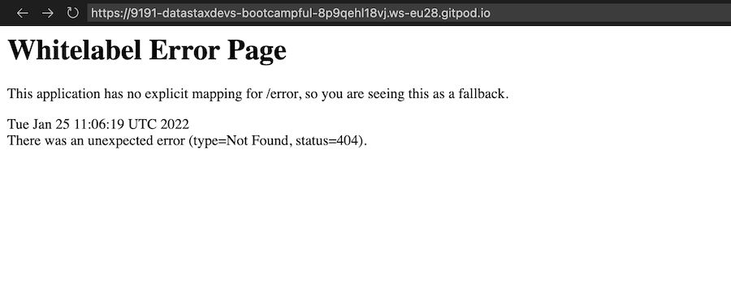

# 🎓🔥 Api and MicroService with Apache Cassandra 🔥🎓


## 7a - Connect to Astra

### ✅ Check connectivity parameters

Make sure you're in the right sub-directory (`java`) by issuing the following command in the GitPod terminal window.

```bash
cd /workspace/bootcamp-fullstack-apps-with-cassandra/week4-api-microservices/java
```

From the GitPod terminal window issue the following command

```bash
gp open src/main/resources/application.properties
```

and notice the following lines have been updated with the appropriate values.

```ini
spring.data.cassandra.username=username
spring.data.cassandra.password=password
datastax.astra.secure-connect-bundle=securebundle
```

Let's do a `clean compile` with the following command

```
mvn clean compile
```

**👁️ Expected output**

```
[INFO] Changes detected - recompiling the module!
[INFO] Compiling 7 source files to /workspace/bootcamp-fullstack-apps-with-cassandra/week4-api-microservices/java/target/classes
[INFO] ------------------------------------------------------------------------
[INFO] BUILD SUCCESS
[INFO] ------------------------------------------------------------------------
[INFO] Total time:  12.515 s
[INFO] Finished at: 2022-01-26T02:19:25Z
[INFO] ------------------------------------------------------------------------

```
### ✅ Run the test

- Look at the class [`Test01_Connect.java`](https://github.com/datastaxdevs/bootcamp-fullstack-apps-with-cassandra/blob/main/week4-api-microservices/java/src/test/java/com/datastaxdev/Test01_Connect.java)

```bash
gp open /workspace/bootcamp-fullstack-apps-with-cassandra/week4-api-microservices/java/src/test/java/com/datastaxdev/Test01_Connect.java
```

- Run the test

```bash
mvn test -Dtest=com.datastaxdev.Test01_Connect.java
```

**👁️ Expected output**

```bash
[INFO] -------------------------------------------------------
[INFO]  T E S T S
[INFO] -------------------------------------------------------
[INFO] Running com.datastaxdev.Test01_Connect
22:26:32.138 INFO  com.datastaxdev.Test01_Connect                :  + [OK] - Connection Established to Astra with Keyspace native_java
[INFO] Tests run: 1, Failures: 0, Errors: 0, Skipped: 0, Time elapsed: 5.3 s - in com.datastaxdev.Test01_Connect
[INFO] 
[INFO] Results:
[INFO] 
[INFO] Tests run: 1, Failures: 0, Errors: 0, Skipped: 0
[INFO] 
[INFO] ------------------------------------------------------------------------
[INFO] BUILD SUCCESS
[INFO] ------------------------------------------------------------------------
[INFO] Total time:  7.393 s
[INFO] Finished at: 2022-01-24T22:26:34Z
[INFO] ------------------------------------------------------------------------
gitpod /workspace/bootcamp-fullstack-apps-with-cassandra/week4-api-microservices/java $
```

## 7b - Create the schema

Lets drop the table if it exists and create anew in the `cqlsh` console with the following command

```
drop table if exists todos.todoitems;
```

You can ignore `timeout error` if it happens.

Back in the Gitpod terminal `bash` tab

### ✅ Run Test

- Look at the class [`Test02_CreateSchema.java`](https://github.com/datastaxdevs/bootcamp-fullstack-apps-with-cassandra/blob/main/week4-api-microservices/java/src/test/java/com/datastaxdev/Test02_CreateSchema.java)

```bash
gp open /workspace/bootcamp-fullstack-apps-with-cassandra/week4-api-microservices/java/src/test/java/com/datastaxdev/Test02_CreateSchema.java
```

- Run the Test

```bash
mvn test -Dtest=com.datastaxdev.Test02_CreateSchema.java
```

**👁️ Expected output**

```bash
[INFO] -------------------------------------------------------
[INFO]  T E S T S
[INFO] -------------------------------------------------------
[INFO] Running com.datastaxdev.Test02_CreateSchema
22:28:05.676 INFO  com.datastaxdev.Test02_CreateSchema           : Connection Established to Astra with Keyspace 'native_java'
22:28:05.732 INFO  com.datastaxdev.Test02_CreateSchema           : Table 'todoitems' has been created (if needed).
[INFO] Tests run: 1, Failures: 0, Errors: 0, Skipped: 0, Time elapsed: 5.217 s - in com.datastaxdev.Test02_CreateSchema
[INFO] 
[INFO] Results:
[INFO] 
[INFO] Tests run: 1, Failures: 0, Errors: 0, Skipped: 0
[INFO] 
[INFO] ------------------------------------------------------------------------
[INFO] BUILD SUCCESS
[INFO] ------------------------------------------------------------------------
[INFO] Total time:  7.298 s
[INFO] Finished at: 2022-01-24T22:28:08Z
[INFO] ------------------------------------------------------------------------
gitpod /workspace/bootcamp-fullstack-apps-with-cassandra/week4-api-microservices/java $ 
```

### ✅ Validate Schema with cqlsh

- Open a terminal `zsh` to open a cqlsh shell (we overrided .zshrc to give you that feature)

```sql
DESCRIBE KEYSPACE todos;
```
**👁️ Expected output**

```sql
Connected to cndb at 127.0.0.1:9042.
[cqlsh 6.8.0 | Cassandra 4.0.0.6816 | CQL spec 3.4.5 | Native protocol v4]
Use HELP for help.
token@cqlsh> describe keyspace todos;

CREATE KEYSPACE todos WITH replication = {'class': 'NetworkTopologyStrategy', 'eu-west-1': '3'}  AND durable_writes = true;

CREATE TABLE todos.todoitems (
    user_id text,
    item_id timeuuid,
    completed boolean,
    offset int,
    title text,
    PRIMARY KEY (user_id, item_id)
) WITH CLUSTERING ORDER BY (item_id ASC)
    AND additional_write_policy = '99PERCENTILE'
    AND bloom_filter_fp_chance = 0.01
    AND caching = {'keys': 'ALL', 'rows_per_partition': 'NONE'}
    AND comment = ''
    AND compaction = {'class': 'org.apache.cassandra.db.compaction.UnifiedCompactionStrategy'}
    AND compression = {'chunk_length_in_kb': '64', 'class': 'org.apache.cassandra.io.compress.LZ4Compressor'}
    AND crc_check_chance = 1.0
    AND default_time_to_live = 0
    AND gc_grace_seconds = 864000
    AND max_index_interval = 2048
    AND memtable_flush_period_in_ms = 0
    AND min_index_interval = 128
    AND read_repair = 'BLOCKING'
    AND speculative_retry = '99PERCENTILE';

token@cqlsh> 
```

## 7c - Save a Task

### ✅ Run Test

- Look at class [`Test03_SaveTask.java`](https://github.com/datastaxdevs/bootcamp-fullstack-apps-with-cassandra/blob/main/week4-api-microservices/java/src/test/java/com/datastaxdev/Test03_SaveTask.java)

```bash
gp open /workspace/bootcamp-fullstack-apps-with-cassandra/week4-api-microservices/java/src/test/java/com/datastaxdev/Test03_SaveTask.java
```

- Run the Test

```bash
mvn test -Dtest=com.datastaxdev.Test03_SaveTask.java
```

**👁️ Expected output**

```bash
[INFO] -------------------------------------------------------
[INFO]  T E S T S
[INFO] -------------------------------------------------------
[INFO] Running com.datastaxdev.Test03_SaveTask
 ________          __                   __                  ________                     .__                                     
 \______ \ _____ _/  |______    _______/  |______  ___  ___ \______ \   _______  __ ____ |  |   ____ ______   ___________  ______
  |    |  \\__  \\   __\__  \  /  ___/\   __\__  \ \  \/  /  |    |  \_/ __ \  \/ // __ \|  |  /  _ \\____ \_/ __ \_  __ \/  ___/
  |    `   \/ __ \|  |  / __ \_\___ \  |  |  / __ \_>    <   |    `   \  ___/\   /\  ___/|  |_(  <_> )  |_> >  ___/|  | \/\___ \ 
 /_______  (____  /__| (____  /____  > |__| (____  /__/\_ \ /_______  /\___  >\_/  \___  >____/\____/|   __/ \___  >__|  /____  >
         \/     \/          \/     \/            \/      \/         \/     \/          \/            |__|        \/           \/ 

 Todobackend with Spring Boot, String Data and Astra  
 The application will start at http://localhost:9191

22:29:23.894 INFO  com.datastaxdev.Test03_SaveTask               : Starting Test03_SaveTask using Java 11.0.12 on datastaxdevs-bootcampful-018516j99u1 with PID 3337 (started by gitpod in /workspace/bootcamp-fullstack-apps-with-cassandra/week4-api-microservices/java)
22:29:23.897 INFO  com.datastaxdev.Test03_SaveTask               : No active profile set, falling back to default profiles: default
22:29:27.926 INFO  com.datastaxdev.Test03_SaveTask               : Started Test03_SaveTask in 4.24 seconds (JVM running for 5.274)
[INFO] Tests run: 1, Failures: 0, Errors: 0, Skipped: 0, Time elapsed: 5.26 s - in com.datastaxdev.Test03_SaveTask
[INFO] 
[INFO] Results:
[INFO] 
[INFO] Tests run: 1, Failures: 0, Errors: 0, Skipped: 0
[INFO] 
[INFO] ------------------------------------------------------------------------
[INFO] BUILD SUCCESS
[INFO] ------------------------------------------------------------------------
[INFO] Total time:  9.367 s
[INFO] Finished at: 2022-01-24T22:29:30Z
[INFO] ------------------------------------------------------------------------
gitpod /workspace/bootcamp-fullstack-apps-with-cassandra/week4-api-microservices/java $ 
```

### ✅ Validate with CqlSh

- Open a terminal `zsh` to open a cqlsh shell (we overrided .zshrc to give you that feature)

```sql
select * from todos.todoitems;
```

**👁️ Expected output**

```bash
token@cqlshs> select * from todos.todoitems;

 user_id | item_id                              | completed | offset | title
---------+--------------------------------------+-----------+--------+--------------
    john | 1793e4e0-7d65-11ec-b3f6-15c8273bc04a |     False |      0 | Sample task1
```

## 7d - Test REST Endpoint

### ✅ Run Test

- Look at the class [`Test04_Controller.java`](https://github.com/datastaxdevs/bootcamp-fullstack-apps-with-cassandra/blob/main/week4-api-microservices/java/src/test/java/com/datastaxdev/Test04_Controller.java)

```bash
gp open /workspace/bootcamp-fullstack-apps-with-cassandra/week4-api-microservices/java/src/test/java/com/datastaxdev/Test04_Controller.java
```

- Run the Test

```bash
mvn test -Dtest=com.datastaxdev.Test04_Controller.java
```

**👁️ Expected output**

```bash
[INFO] -------------------------------------------------------
[INFO]  T E S T S
[INFO] -------------------------------------------------------
[INFO] Running com.datastaxdev.Test04_Controller
 ________          __                   __                  ________                     .__                                     
 \______ \ _____ _/  |______    _______/  |______  ___  ___ \______ \   _______  __ ____ |  |   ____ ______   ___________  ______
  |    |  \\__  \\   __\__  \  /  ___/\   __\__  \ \  \/  /  |    |  \_/ __ \  \/ // __ \|  |  /  _ \\____ \_/ __ \_  __ \/  ___/
  |    `   \/ __ \|  |  / __ \_\___ \  |  |  / __ \_>    <   |    `   \  ___/\   /\  ___/|  |_(  <_> )  |_> >  ___/|  | \/\___ \ 
 /_______  (____  /__| (____  /____  > |__| (____  /__/\_ \ /_______  /\___  >\_/  \___  >____/\____/|   __/ \___  >__|  /____  >
         \/     \/          \/     \/            \/      \/         \/     \/          \/            |__|        \/           \/ 

 Todobackend with Spring Boot, String Data and Astra  
 The application will start at http://localhost:0

22:35:11.856 INFO  com.datastaxdev.Test04_Controller             : Starting Test04_Controller using Java 11.0.12 on datastaxdevs-bootcampful-018516j99u1 with PID 3856 (started by gitpod in /workspace/bootcamp-fullstack-apps-with-cassandra/week4-api-microservices/java)
22:35:11.859 INFO  com.datastaxdev.Test04_Controller             : No active profile set, falling back to default profiles: default
22:35:16.246 INFO  com.datastaxdev.Test04_Controller             : Started Test04_Controller in 4.626 seconds (JVM running for 5.794)
[INFO] Tests run: 1, Failures: 0, Errors: 0, Skipped: 0, Time elapsed: 5.93 s - in com.datastaxdev.Test04_Controller
[INFO] 
[INFO] Results:
[INFO] 
[INFO] Tests run: 1, Failures: 0, Errors: 0, Skipped: 0
[INFO] 
[INFO] ------------------------------------------------------------------------
[INFO] BUILD SUCCESS
[INFO] ------------------------------------------------------------------------
[INFO] Total time:  10.003 s
[INFO] Finished at: 2022-01-24T22:35:19Z
[INFO] ------------------------------------------------------------------------
```

## 7e - Start the application

Now that we know the application is working we can go ahead and start it

### ✅ Start the application

```bash
mvn spring-boot:run
```

**👁️ Expected output**

After Downloading half of internet you should get.

```bash
Picked up JAVA_TOOL_OPTIONS:  -Xmx2576m
 ________          __                   __                  ________                     .__                                     
 \______ \ _____ _/  |______    _______/  |______  ___  ___ \______ \   _______  __ ____ |  |   ____ ______   ___________  ______
  |    |  \\__  \\   __\__  \  /  ___/\   __\__  \ \  \/  /  |    |  \_/ __ \  \/ // __ \|  |  /  _ \\____ \_/ __ \_  __ \/  ___/
  |    `   \/ __ \|  |  / __ \_\___ \  |  |  / __ \_>    <   |    `   \  ___/\   /\  ___/|  |_(  <_> )  |_> >  ___/|  | \/\___ \ 
 /_______  (____  /__| (____  /____  > |__| (____  /__/\_ \ /_______  /\___  >\_/  \___  >____/\____/|   __/ \___  >__|  /____  >
         \/     \/          \/     \/            \/      \/         \/     \/          \/            |__|        \/           \/ 

 Todobackend with Spring Boot, String Data and Astra  
 The application will start at http://localhost:9191

22:36:33.518 INFO  com.datastaxdev.TodoApplication               : Starting TodoApplication using Java 11.0.12 on datastaxdevs-bootcampful-018516j99u1 with PID 4220 (/workspace/bootcamp-fullstack-apps-with-cassandra/week4-api-microservices/java/target/classes started by gitpod in /workspace/bootcamp-fullstack-apps-with-cassandra/week4-api-microservices/java)
22:36:33.519 INFO  com.datastaxdev.TodoApplication               : No active profile set, falling back to default profiles: default
22:36:36.661 INFO  com.datastaxdev.TodoApplication               : Started TodoApplication in 3.414 seconds (JVM running for 3.762)
```

- A popup may ask you to set the port `9191` public, please accept. To get the public URL of your service.



If need be explictly make port `9191` public as shown below. The final state should be `public` (click on the lock icon).




- Open up another `bash` tab in the Gitpod terminal window and **leave the application running** in the other tab.

- The application is now running on a translated URL if you want to know which one:

```bash
gp url 9191
```

**👁️ Expected output**

```
https://9191-datastaxdevs-bootcampful-8p9qehl18vj.ws-eu28.gitpod.io
```

- You can try to open the application, but you will get an error screen as there is no resources listening at root, as seen below, which is fine.

```bash
gp preview $(gp url 9191)
```



## 7f - Run the integration tests

### ✅ Open the API in the preview

```bash
gp preview $(gp url 9191)/api/v1/john/todos/
```

You should see some of your tasks


- You might be tempted to run the unit test suite now (as well you should)

```bash
gp preview https://todobackend.com/specs/index.html?$(gp url 9191)/api/v1/test/todos/
```

You will get an error this is expected, it is a limitation of the preview in gitpod.


- Open the same link in a new tabs in your browser


## 7g - Run the client

### ✅ Open the Client in the preview

Change in the url the `specs` path with `client`

```bash
gp preview https://todobackend.com/client/index.html?$(gp url 9191)/api/v1/test/todos/
```


If running into the gitpod preview limitations, open the link in a new TAB.


### ✅ Validate with cqlsh

```cql
token@cqlsh:native_java> select * from todoitems;

 user_id  | item_id                              | completed | offset | title
----------+--------------------------------------+-----------+--------+---------------------------------
     test | 4828ffc0-7d68-11ec-8c88-2913db53e434 |     False |    523 |                            blah
     test | 483ada10-7d68-11ec-8c88-2913db53e434 |     False |     95 |                            null
     test | 48625f40-7d68-11ec-8c88-2913db53e434 |     False |     95 |                            null
 bootcamp | 9e6e2760-7d69-11ec-8c88-2913db53e434 |     False |      1 |                   Week 1 - Todo
 bootcamp | a2fb77b0-7d69-11ec-8c88-2913db53e434 |     False |      2 |         Week 2 - data modelling
 bootcamp | a5b3b9e0-7d69-11ec-8c88-2913db53e434 |     False |      3 |      Week 3 - App developerment
```

Congratulation you can come back to previous

[BACK](../README.MD)
