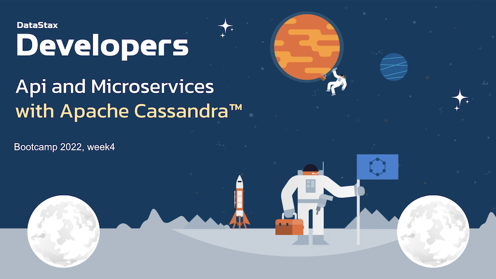
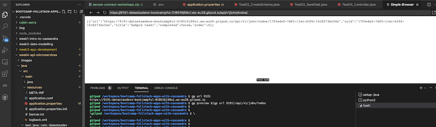
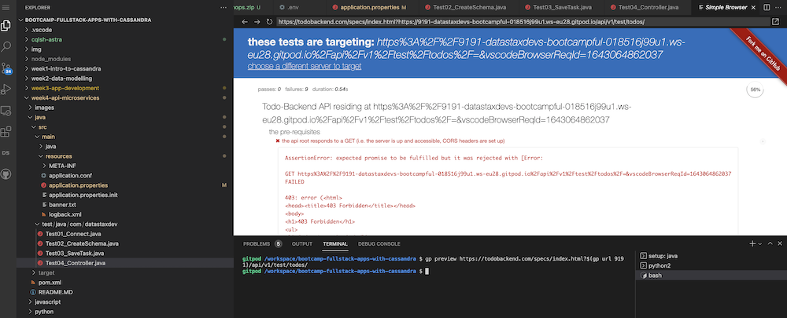
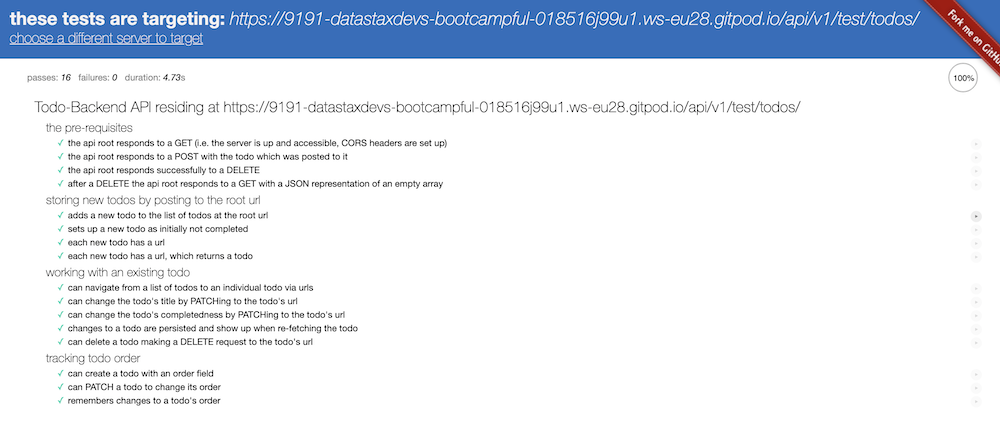
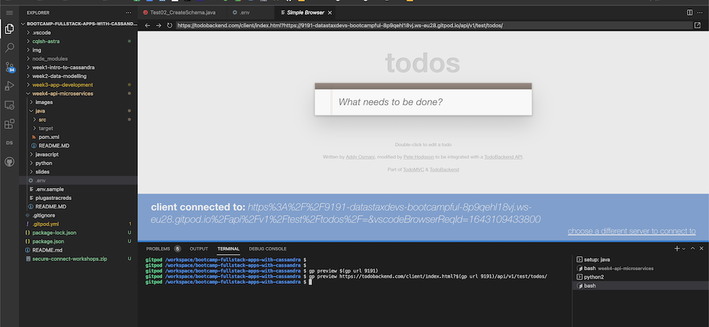
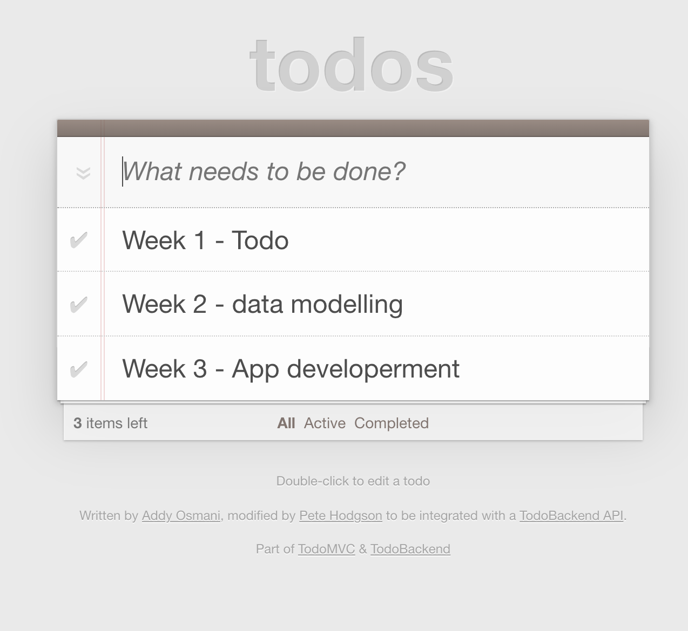

# 🎓🔥 API and MicroServices with Apache Cassandra - Python 🔥🎓




## Python Todos

An implementation of a Todo's API using ExpressJS and the Cassandra Python driver.


## 7a - Connect to Astra

### ✅ Check connectivity parameters

- Make sure you're in the right sub-directory (`python`) by issuing the following command in the GitPod terminal window.

```bash
cd /workspace/bootcamp-fullstack-apps-with-cassandra/week4-api-microservices/python
```

- Verify again you're in the `python` sub-directory using the following command

```bash
pwd
```

**👁️ Expected output**

```
/workspace/bootcamp-fullstack-apps-with-cassandra/week4-api-microservices/python
```

- From the GitPod terminal window issue the following command

```bash
open connection.py
```

and notice the following lines have been updated with the appropriate values.

```python
# This is the "Client Id" value you obtained earlier
USERNAME = "FXXXXXXXXXXl";
# This is the "Client Secret" value you obtained earlier
PASSWORD =
  "FXXXXXXXXXXXXXXXXXXXXXXXXXXXXXXXXXXXXXXXXXXXXXXXXXXXXXdeOE.kio_.L981NQ.xq5HqXDB7s_FIJC.ssbLgbdz+G1IC0BCwIA_ZrwPrQNJWUiv26uZf2f4wo";
```

### ✅ Run the test

You are ready and can now test the connection to Astra with the following command

```bash
python Test01_Connect.py
```

**👁️ Expected output**

```
========================================
Start exercise
========================================
Your are now connected to Astra 'cndb' at 'us-east1'
SUCCESS
```

Now that we're successfully able to establish the connection, take a moment to walk through how the connection has been established by opening the source code using the following command

```
gp open Test01_Connect.py
```

## 7b - Create the schema

### ✅ Run Test

Let's create the table. We will **drop** a table if it already exists with the same name.

- Take a moment to review the code with the following command

```bash
gp open Test02_CreateSchema.py
```

- After reviewing the code, run the following command in the GitPod terminal window which runs the code after making the connection.

```bash
python Test02_CreateSchema.py
```

**👁️ Expected output**

```bash
========================================
Start exercise
SUCCESS
========================================
```

### ✅ Validate Schema with Cqlsh

- Open a terminal `cqlsh` to open a cqlsh shell (we overrided .zshrc to give you that feature)

```cql
DESCRIBE KEYSPACE todos;
```

**👁️ Expected output**

```cql
Connected to cndb at 127.0.0.1:9042.
[cqlsh 6.8.0 | Cassandra 4.0.0.6816 | CQL spec 3.4.5 | Native protocol v4]
Use HELP for help.
token@cqlsh> describe keyspace todos;

CREATE KEYSPACE todos WITH replication = {'class': 'NetworkTopologyStrategy', 'eu-west-1': '3'}  AND durable_writes = true;

CREATE TABLE todos.todoitems (
    user_id text,
    item_id timeuuid,
    completed boolean,
    offset int,
    title text,
    PRIMARY KEY (user_id, item_id)
) WITH CLUSTERING ORDER BY (item_id ASC)
    AND additional_write_policy = '99PERCENTILE'
    AND bloom_filter_fp_chance = 0.01
    AND caching = {'keys': 'ALL', 'rows_per_partition': 'NONE'}
    AND comment = ''
    AND compaction = {'class': 'org.apache.cassandra.db.compaction.UnifiedCompactionStrategy'}
    AND compression = {'chunk_length_in_kb': '64', 'class': 'org.apache.cassandra.io.compress.LZ4Compressor'}
    AND crc_check_chance = 1.0
    AND default_time_to_live = 0
    AND gc_grace_seconds = 864000
    AND max_index_interval = 2048
    AND memtable_flush_period_in_ms = 0
    AND min_index_interval = 128
    AND read_repair = 'BLOCKING'
    AND speculative_retry = '99PERCENTILE';

token@cqlsh>
```

## 7c - Save a Task

### ✅ Run Test

Let's insert some items.

- Take a moment to review the code with the following command

```bash
gp open Test03_SaveTask.py
```

- After reviewing the code, run the following command in the GitPod terminal window which runs the code after making the connection.

```bash
python Test03_SaveTask.py
```

**👁️ Expected output**

```bash
========================================
Start exercise
SUCCESS
========================================
```

### ✅ Validate with Cqlsh

- Open a terminal `zsh` to open a cqlsh shell (we overrided .zshrc to give you that feature)

```cql
select * from todos.todoitems;
```

**👁️ Expected output**

```bash
token@cqlshs> select * from todos.todoitems;

 user_id | item_id                              | completed | offset | title
---------+--------------------------------------+-----------+--------+--------------
    john | 1793e4e0-7d65-11ec-b3f6-15c8273bc04a |     False |      0 | Sample task1
```

## 7d - Test REST Endpoint

### ✅ Run Test

## 7e - Start the application

Now that we know the application is working we can go ahead and start it

### ✅ Start the application

## 7f - Run the integrations tests

### ✅ Open the Api in the preview

```bash
gp preview $(gp url 9191)/api/v1/john/todos/
```

You should see some of your tasks



- You might tempted to run the unit test suite now (well you should)

```bash
gp preview https://todobackend.com/specs/index.html?$(gp url 9191)/api/v1/test/todos/
```

You will get an error this is expected, it is a limitation of the preview in gitpod.



- Open the same link in a new tabs in your browser



## 7g - Run the client

### ✅ Open the Client in the preview

Change in the url the `specs` path by `client`

```bash
gp preview https://todobackend.com/client/index.html?$(gp url 9191)/api/v1/test/todos/
```



If running into the gitpod preview limitations, open the link in a new TAB.



### ✅ Validate with cqlsh

```cql
select * from todos.todoitems;
```

**👁️ Expected output**

```

 user_id  | item_id                              | completed | offset | title
----------+--------------------------------------+-----------+--------+---------------------------------
     test | 4828ffc0-7d68-11ec-8c88-2913db53e434 |     False |    523 |                            blah
     test | 483ada10-7d68-11ec-8c88-2913db53e434 |     False |     95 |                            null
     test | 48625f40-7d68-11ec-8c88-2913db53e434 |     False |     95 |                            null
 bootcamp | 9e6e2760-7d69-11ec-8c88-2913db53e434 |     False |      1 |                   Week 1 - Todo
 bootcamp | a2fb77b0-7d69-11ec-8c88-2913db53e434 |     False |      2 |         Week 2 - data modelling
 bootcamp | a5b3b9e0-7d69-11ec-8c88-2913db53e434 |     False |      3 |      Week 3 - App developerment
```

Congratulations! You can now head back!

[BACK](../README.MD)